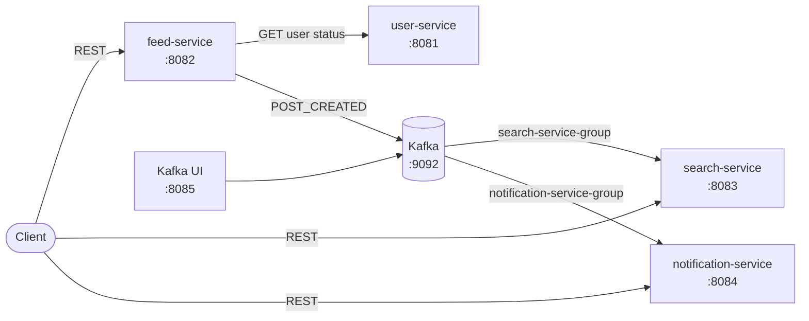

# DevConnect Microservice Demo

DevConnect là project minh họa một luồng tạo bài viết theo kiến trúc microservice bằng Java 21, Spring Boot và Apache Kafka. Project kết hợp:

- HTTP đồng bộ để `feed-service` xác minh trạng thái tác giả với `user-service`.
- Async Servlet + `CompletableFuture` để tách blocking I/O khỏi HTTP request thread.
- Event-driven communication qua Kafka để cập nhật search index và tạo notification theo mô hình eventual consistency.

Project hiện là demo chạy local: dữ liệu được lưu trong bộ nhớ, chưa có database, authentication, service discovery hay API gateway.

## Kiến trúc tổng quan



| Thành phần | Port mặc định | Vai trò |
|---|---:|---|
| `user-service` | 8081 | Cung cấp trạng thái user nội bộ. |
| `feed-service` | 8082 | Tạo/đọc post, kiểm tra tác giả và publish event. |
| `search-service` | 8083 | Consume event, lập chỉ mục và tìm post theo nội dung. |
| `notification-service` | 8084 | Consume event và tạo notification cho tác giả. |
| Kafka | 9092 | Broker cho topic `post-events`. |
| Kafka UI | 8085 | Giao diện quan sát broker/topic/message khi chạy local. |

Luồng chính khi tạo post:

1. Client gọi `POST /api/feed/posts`.
2. `feed-service` chuyển tác vụ sang executor `postTaskExecutor`.
3. `feed-service` gọi `user-service` để kiểm tra tác giả có trạng thái `ACTIVE`.
4. Post được lưu vào bộ nhớ của `feed-service`.
5. `feed-service` gửi event `POST_CREATED` lên topic `post-events` và trả HTTP 200.
6. `search-service` và `notification-service` xử lý cùng event bằng hai consumer group khác nhau.
7. Search result và notification xuất hiện sau đó theo eventual consistency.

Xem phân tích chi tiết tại [Kiến trúc hệ thống](docs/ARCHITECTURE.md).

## Công nghệ

- Java 21
- Spring Boot 4.1.0
- Spring MVC và `RestClient`
- Spring Kafka / Apache Kafka 4.1.2
- Maven multi-module
- Docker Compose cho hạ tầng local
- JUnit 5, Spring Test và Mockito

## Yêu cầu môi trường

- JDK 21
- Maven 3.9+; hoặc Maven Wrapper có trong `feed-service`/`user-service`
- Docker Engine hoặc Docker Desktop có hỗ trợ Docker Compose v2
- PowerShell, Bash hoặc một REST client để chạy smoke test

Kiểm tra nhanh:

```powershell
java -version
mvn -version
docker --version
docker compose version
```

## Chạy project

### 1. Khởi động Kafka

Tại thư mục gốc:

```powershell
docker compose up -d
docker compose ps
```

Kafka lắng nghe tại `localhost:9092`; Kafka UI có tại <http://localhost:8085>.

### 2. Khởi động bốn service

Mở bốn terminal tại thư mục gốc và chạy lần lượt:

```powershell
mvn -pl user-service spring-boot:run
```

```powershell
mvn -pl feed-service spring-boot:run
```

```powershell
mvn -pl search-service spring-boot:run
```

```powershell
mvn -pl notification-service spring-boot:run
```

Thứ tự khuyến nghị là Kafka → `user-service` → `feed-service` → hai consumer service. Kafka consumer có thể retry kết nối nếu broker chưa sẵn sàng, nhưng khởi động theo thứ tự trên giúp log dễ đọc hơn.

### 3. Kiểm tra end-to-end

Project có sẵn ba user demo:

| User | Trạng thái | Có thể tạo post |
|---|---|---|
| `u001` | `ACTIVE` | Có |
| `u002` | `ACTIVE` | Có |
| `u003` | `INACTIVE` | Không |

Tạo post:

```powershell
$body = @{
  authorId = "u001"
  content  = "Hoc microservice voi Kafka"
} | ConvertTo-Json

$created = Invoke-RestMethod `
  -Method Post `
  -Uri "http://localhost:8082/api/feed/posts" `
  -ContentType "application/json" `
  -Body $body

$created
```

Sau khi consumer xử lý event, kiểm tra search và notification:

```powershell
Invoke-RestMethod "http://localhost:8083/api/search/posts?keyword=Kafka"
Invoke-RestMethod "http://localhost:8084/api/notifications/users/u001"
```

Do xử lý Kafka là bất đồng bộ, hai truy vấn cuối có thể trả danh sách rỗng nếu gọi ngay lập tức; hãy thử lại sau một khoảng ngắn.

### 4. Dừng môi trường

Dừng các Spring Boot process bằng `Ctrl+C`, sau đó:

```powershell
docker compose down
```

## Build và test

Chạy toàn bộ test từ root:

```powershell
mvn test
```

Build bốn executable JAR:

```powershell
mvn clean package
```

Chạy test riêng một module:

```powershell
mvn -pl feed-service test
```

Các test hiện có bao phủ việc load context, async executor của luồng tạo post, async MVC response và mapping `BusinessException`. `search-service` và `notification-service` hiện chưa có test tự động.

## Cấu trúc repository

```text
.
├── pom.xml                         # Parent POM và danh sách module
├── docker-compose.yml              # Kafka và Kafka UI cho local
├── user-service/                   # User status API nội bộ
├── feed-service/                   # Post API, HTTP client, async và producer
├── search-service/                 # Search API và Kafka consumer
├── notification-service/           # Notification API và Kafka consumer
├── docs/
│   ├── ARCHITECTURE.md             # Kiến trúc, luồng dữ liệu, consistency
│   ├── API.md                      # REST API contract và ví dụ lỗi
│   ├── EVENTS.md                   # Kafka event contract và semantics
│   └── DEVELOPMENT.md              # Setup, cấu hình, build, vận hành local
└── ASYNC-JAVA.md                   # Giải thích chuyên sâu về Async Java
```

## Tài liệu chi tiết

- [Kiến trúc hệ thống](docs/ARCHITECTURE.md)
- [REST API reference](docs/API.md)
- [Kafka event reference](docs/EVENTS.md)
- [Hướng dẫn phát triển và vận hành local](docs/DEVELOPMENT.md)
- [Async Java trong DevConnect](ASYNC-JAVA.md)

## Giới hạn hiện tại

- Mọi business data nằm trong `ConcurrentHashMap` và mất khi restart service.
- Publish Kafka là fire-and-observe: lỗi gửi event được ghi log nhưng không rollback post.
- Chưa có timeout/retry/circuit breaker cho lời gọi từ Feed sang User Service.
- Chưa có retry policy, dead-letter topic hoặc schema registry cho Kafka.
- Chưa có authentication/authorization, rate limiting, health endpoint và metrics.
- Docker Compose chỉ dựng hạ tầng Kafka; bốn application service vẫn chạy trực tiếp trên host.
- Kafka UI dùng tag `latest`, phù hợp demo nhưng nên pin version trong môi trường ổn định.

Các giới hạn và hướng nâng cấp production được phân tích thêm trong [Kiến trúc hệ thống](docs/ARCHITECTURE.md#khả-năng-sẵn-sàng-cho-production).
