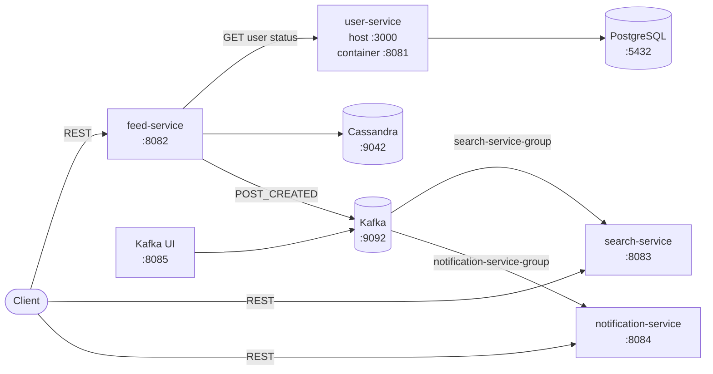

# DevConnect Microservice Demo

> Tài liệu đầy đủ: [Mục lục documentation](docs/README.md)

DevConnect là project minh họa một luồng tạo bài viết theo kiến trúc microservice bằng Java 21, Spring Boot và Apache Kafka. Project kết hợp:

- HTTP đồng bộ để `feed-service` xác minh trạng thái tác giả với `user-service`.
- Async Servlet + `CompletableFuture` để tách blocking I/O khỏi HTTP request thread.
- Event-driven communication qua Kafka để cập nhật search index và tạo notification theo mô hình eventual consistency.

Project dùng polyglot persistence: PostgreSQL lưu user, Cassandra lưu post; search index và notification vẫn là read model trong bộ nhớ. Đây vẫn là demo local, chưa có authentication, service discovery hay API gateway.

Toàn bộ runtime gồm 9 Compose service: 4 application, 4 infrastructure service và 1 one-shot Cassandra initializer.

## Kiến trúc tổng quan



| Thành phần | Port mặc định | Vai trò |
|---|---:|---|
| `user-service` | 3000 (host) / 8081 (container) | Cung cấp trạng thái user nội bộ. |
| `feed-service` | 8082 | Tạo/đọc post, kiểm tra tác giả và publish event. |
| `search-service` | 8083 | Consume event, lập chỉ mục và tìm post theo nội dung. |
| `notification-service` | 8084 | Consume event và tạo notification cho tác giả. |
| PostgreSQL | 5432 | Lưu bảng `users` của User Service. |
| Cassandra | 9042 | Lưu `posts_by_feed` và `posts_by_id` của Feed Service. |
| Kafka | 9092 | Broker cho topic `post-events`. |
| Kafka UI | 8085 | Giao diện quan sát broker/topic/message khi chạy local. |

Luồng chính khi tạo post:

1. Client gọi `POST /api/feed/posts`.
2. `feed-service` chuyển tác vụ sang executor `postTaskExecutor`.
3. `feed-service` gọi `user-service` để kiểm tra tác giả có trạng thái `ACTIVE`.
4. Post được ghi bằng logged batch vào hai Cassandra read model.
5. `feed-service` gửi event `POST_CREATED` lên topic `post-events` và trả HTTP 200.
6. `search-service` và `notification-service` xử lý cùng event bằng hai consumer group khác nhau.
7. Search result và notification xuất hiện sau đó theo eventual consistency.

Xem phân tích chi tiết tại [Kiến trúc hệ thống](docs/ARCHITECTURE.md).

## Công nghệ

- Java 21
- Spring Boot 4.1.0
- Spring MVC và `RestClient`
- Spring Kafka / Apache Kafka 4.1.2
- Spring Data JPA, Hibernate, Flyway và PostgreSQL 18.4
- Spring Data Cassandra và Apache Cassandra 5.0.8
- Maven multi-module
- Docker Compose cho toàn bộ local stack
- JUnit 5, Spring Test và Mockito

## Yêu cầu môi trường

- Docker Engine hoặc Docker Desktop có hỗ trợ Docker Compose v2
- PowerShell, Bash hoặc một REST client để chạy smoke test
- JDK 21 và Maven 3.9+ chỉ cần khi build/test trực tiếp trên host

Kiểm tra nhanh:

```powershell
docker --version
docker compose version
```

## Chạy project

### 1. Build và khởi động toàn bộ hệ thống

Tại thư mục gốc:

```powershell
docker compose up -d --build
docker compose ps -a
```

Lệnh này build cả bốn Spring Boot image, khởi động database/messaging và tự sắp xếp dependency. Chờ `postgres`, `cassandra`, `kafka` healthy; `cassandra-init` phải kết thúc với exit code 0. Các endpoint local:

- PostgreSQL: `localhost:5432`, database `devconnect_users`.
- Cassandra: `localhost:9042`, keyspace `devconnect_feed`.
- Kafka: `localhost:9092`.
- Kafka UI: <http://localhost:8085>.
- User API: `http://localhost:3000`.
- Feed API: `http://localhost:8082`.
- Search API: `http://localhost:8083`.
- Notification API: `http://localhost:8084`.

Trên Ubuntu/WSL, nếu `docker compose config --services` chỉ hiện 5 service, đang dùng source hoặc Compose file cũ. Xem [cách xác nhận và đồng bộ source](docs/DOCKER.md#3-đảm-bảo-đang-dùng-source-mới-nhất).

### 2. Theo dõi service

Xem trạng thái và log:

```powershell
docker compose ps -a
docker compose logs -f user-service feed-service search-service notification-service
```

Nhấn `Ctrl+C` chỉ thoát chế độ theo dõi log; container vẫn chạy ở background.

### 3. Kiểm tra end-to-end

Project có sẵn ba user demo:

| User | Trạng thái | Có thể tạo post |
|---|---|---|
| `u001` | `ACTIVE` | Có |
| `u002` | `ACTIVE` | Có |
| `u003` | `INACTIVE` | Không |

Tạo post:

```powershell
$body = @{
  authorId = "u001"
  content  = "Hoc microservice voi Kafka"
} | ConvertTo-Json

$created = Invoke-RestMethod `
  -Method Post `
  -Uri "http://localhost:8082/api/feed/posts" `
  -ContentType "application/json" `
  -Body $body

$created
```

Sau khi consumer xử lý event, kiểm tra search và notification:

```powershell
Invoke-RestMethod "http://localhost:8083/api/search/posts?keyword=Kafka"
Invoke-RestMethod "http://localhost:8084/api/notifications/users/u001"
```

Do xử lý Kafka là bất đồng bộ, hai truy vấn cuối có thể trả danh sách rỗng nếu gọi ngay lập tức; hãy thử lại sau một khoảng ngắn.

Ví dụ tương đương trên Ubuntu/macOS:

```bash
curl -X POST http://localhost:8082/api/feed/posts \
  -H 'Content-Type: application/json' \
  -d '{"authorId":"u001","content":"Hoc microservice voi Kafka"}'

curl 'http://localhost:8083/api/search/posts?keyword=Kafka'
curl 'http://localhost:8084/api/notifications/users/u001'
```

### 4. Dừng môi trường

```powershell
docker compose down
```

PostgreSQL và Cassandra dùng named volume nên dữ liệu vẫn còn sau `down`. Chỉ dùng `docker compose down -v` khi muốn xóa toàn bộ dữ liệu local.

## Build và test

Chạy toàn bộ test từ root:

```powershell
mvn test
```

Build bốn executable JAR:

```powershell
mvn clean package
```

Chạy test riêng một module:

```powershell
mvn -pl feed-service test
```

Các test hiện có bao phủ Flyway migration/seed user trên H2, context, Cassandra mapping/logged batch, async executor, async MVC response và mapping `BusinessException`. `search-service` và `notification-service` hiện chưa có test tự động.

## Cấu trúc repository

```text
.
├── pom.xml                         # Parent POM và danh sách module
├── docker-compose.yml              # Toàn bộ infrastructure và application stack
├── .dockerignore                   # Loại artifact/metadata khỏi build context
├── user-service/                   # User API, JPA, Flyway và Dockerfile
├── feed-service/                   # Post API, Cassandra, Kafka và Dockerfile
├── search-service/                 # Search consumer/API và Dockerfile
├── notification-service/           # Notification consumer/API và Dockerfile
├── docs/
│   ├── README.md                   # Mục lục documentation
│   ├── ARCHITECTURE.md             # Kiến trúc, luồng dữ liệu, consistency
│   ├── API.md                      # REST API contract và ví dụ lỗi
│   ├── EVENTS.md                   # Kafka event contract và semantics
│   ├── DATABASE.md                 # PostgreSQL/Cassandra schema và query model
│   ├── DOCKER.md                   # Docker, Ubuntu/WSL và troubleshooting
│   └── DEVELOPMENT.md              # Setup, cấu hình, build, vận hành local
└── ASYNC-JAVA.md                   # Giải thích chuyên sâu về Async Java
```

## Tài liệu chi tiết

- [Mục lục documentation](docs/README.md)
- [Kiến trúc hệ thống](docs/ARCHITECTURE.md)
- [REST API reference](docs/API.md)
- [Kafka event reference](docs/EVENTS.md)
- [PostgreSQL và Cassandra](docs/DATABASE.md)
- [Docker và Ubuntu/WSL](docs/DOCKER.md)
- [Hướng dẫn phát triển và vận hành local](docs/DEVELOPMENT.md)
- [Async Java trong DevConnect](ASYNC-JAVA.md)

## Giới hạn hiện tại

- Search index, notification và notification deduplication vẫn nằm trong `ConcurrentHashMap` và mất khi restart service.
- Cassandra feed hiện dùng một partition `feed_id=global`; phù hợp demo nhưng sẽ thành hot/unbounded partition ở quy mô lớn.
- Publish Kafka là fire-and-observe: lỗi gửi event được ghi log nhưng không rollback post.
- Chưa có timeout/retry/circuit breaker cho lời gọi từ Feed sang User Service.
- Chưa có retry policy, dead-letter topic hoặc schema registry cho Kafka.
- Chưa có authentication/authorization, rate limiting, health endpoint và metrics.
- Application image dùng multi-stage build và non-root runtime user, nhưng chưa có image signing/SBOM/security scanning trong pipeline.
- Kafka UI dùng tag `latest`, phù hợp demo nhưng nên pin version trong môi trường ổn định.

Các giới hạn và hướng nâng cấp production được phân tích thêm trong [Kiến trúc hệ thống](docs/ARCHITECTURE.md#khả-năng-sẵn-sàng-cho-production).
