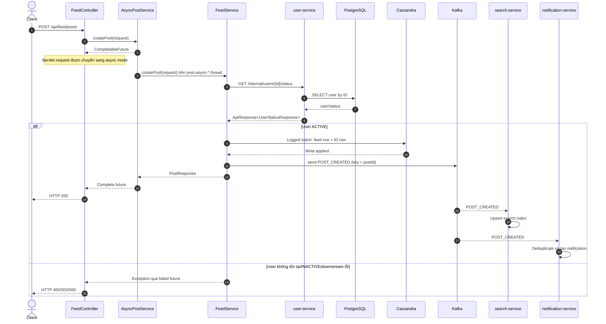
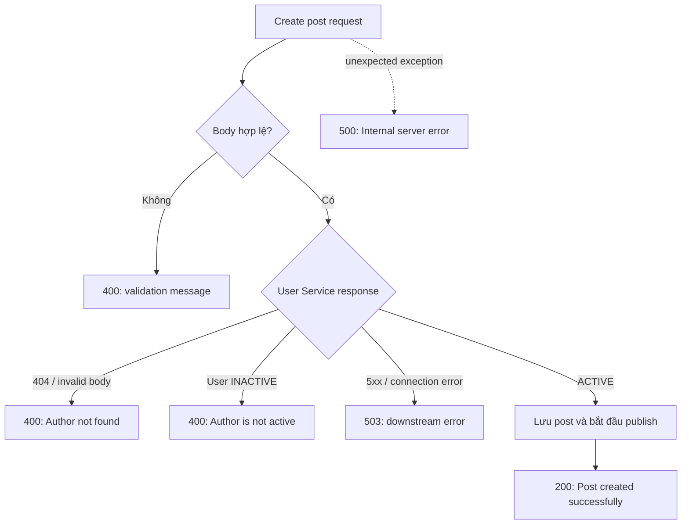

# Kiến trúc hệ thống

> Điều hướng: [Mục lục](README.md) · [Docker](DOCKER.md) · [Database](DATABASE.md) · [API](API.md) · [Events](EVENTS.md)

## 1. Mục tiêu và phạm vi

DevConnect minh họa một use case nhỏ nhưng có đủ hai kiểu giao tiếp thường gặp trong microservice:

- Giao tiếp đồng bộ khi kết quả của service khác là điều kiện để chấp nhận request.
- Giao tiếp bất đồng bộ khi các side effect có thể hoàn thành sau response và chấp nhận eventual consistency.

Use case trung tâm là tạo post. Tác giả phải tồn tại và có trạng thái `ACTIVE`; việc lập chỉ mục search và tạo notification không cần hoàn tất trước khi client nhận response.

## 2. Phân rã service

### `user-service`

Sở hữu thông tin trạng thái user trong PostgreSQL và chỉ cung cấp endpoint nội bộ `GET /internal/users/{userId}/status`. Spring Data JPA cung cấp repository; Flyway quản lý schema và seed data.

Dữ liệu demo được tạo bởi migration `V1__create_users.sql`:

- `u001`: `ACTIVE`
- `u002`: `ACTIVE`
- `u003`: `INACTIVE`

Service chưa có API tạo/cập nhật user; muốn thay đổi dữ liệu cần migration mới hoặc thao tác trực tiếp trong môi trường local.

### `feed-service`

Là service điều phối luồng tạo post:

- Validate `authorId` và `content` không rỗng.
- Gọi `user-service` bằng Spring `RestClient`.
- Áp dụng rule tác giả phải `ACTIVE`.
- Ghi post vào Cassandra bằng hai read model `posts_by_feed` và `posts_by_id`.
- Phát `POST_CREATED` bằng `KafkaTemplate`.
- Cung cấp API lấy danh sách và chi tiết post.

Đây là service duy nhất có exception response chuẩn hóa cho validation, business error, downstream error và unexpected error.

### `search-service`

Consume `POST_CREATED`, upsert post vào index trong memory theo `postId`, và tìm kiếm không phân biệt hoa thường bằng phép `String.contains` trên nội dung.

Đây không phải full-text search engine: không có tokenization, ranking, stemming, pagination hay persistent index.

### `notification-service`

Consume `POST_CREATED` và tạo một notification cho chính tác giả. Service lưu thêm `processedEventIds` để bỏ qua event trùng theo `eventId` trong vòng đời hiện tại của process.

Idempotency này cũng chỉ nằm trong memory, nên không còn hiệu lực sau restart.

### Bản đồ code chính

| Module | Entry point | HTTP adapter | Business/persistence | Messaging |
|---|---|---|---|---|
| User | `UserServiceApplication` | `UserInternalController` | `UserService`, `UserRepository`, `UserEntity` | Không |
| Feed | `FeedServiceApplication` | `FeedController` | `AsyncPostService`, `FeedService`, `CassandraPostStore` | `PostEventPublisher` |
| Search | `SearchServiceApplication` | `SearchController` | `PostSearchService` | `PostCreatedEventListener` |
| Notification | `NotificationServiceApplication` | `NotificationController` | `NotificationService` | `PostCreatedEventListener` |

Controller chỉ xử lý HTTP contract; service chứa use case; repository/store xử lý persistence; listener/publisher là messaging adapter.

## 3. Luồng tạo post



### Async bên trong `feed-service`

`AsyncPostService.createPost()` được annotate `@Async("postTaskExecutor")` và trả `CompletableFuture`. Spring MVC giữ HTTP connection bằng async servlet processing, còn blocking call đến `user-service` chạy trên pool `post-async-*`.

Executor mặc định:

| Thuộc tính | Giá trị | Ý nghĩa |
|---|---:|---|
| Core pool size | 4 | Số worker duy trì bình thường. |
| Max pool size | 16 | Số worker tối đa khi queue đầy. |
| Queue capacity | 100 | Số task chờ tối đa trong memory. |
| Await termination | 30 giây | Thời gian chờ task khi shutdown. |
| Rejection policy | `CallerRunsPolicy` | Request thread tự chạy task khi pool và queue đều đầy, tạo backpressure. |

Async này không biến `RestClient` thành non-blocking I/O; nó chỉ chuyển nơi chờ sang một executor được giới hạn riêng. Xem [Async Java trong DevConnect](../ASYNC-JAVA.md) để hiểu chi tiết.

### Async giữa các service

Kafka tách response tạo post khỏi search và notification. Hai consumer dùng group ID khác nhau, do đó mỗi group đều nhận một bản của event:

```text
post-events
├── search-service-group       -> cập nhật search index
└── notification-service-group -> tạo notification
```

Trong cùng một group, Kafka phân phối mỗi partition cho một consumer instance tại một thời điểm. Producer dùng `postId` làm message key, nên các event cùng post sẽ ổn định trên cùng partition khi số partition không đổi.

## 4. Dữ liệu và quyền sở hữu

| Dữ liệu | Service sở hữu | Storage hiện tại | Mất khi restart app |
|---|---|---|---|
| User status | `user-service` | PostgreSQL `users` | Không |
| Post | `feed-service` | Cassandra `posts_by_feed`, `posts_by_id` | Không |
| Search index | `search-service` | `ConcurrentHashMap<postId, post>` | Có |
| Notification | `notification-service` | `ConcurrentHashMap<notificationId, notification>` | Có |
| Processed event IDs | `notification-service` | `ConcurrentHashMap<eventId, boolean>` | Có |

Không service nào đọc trực tiếp storage của service khác. `feed-service` lấy trạng thái user qua API; search và notification xây read model riêng từ event.

### PostgreSQL schema

Flyway tạo bảng `users(user_id varchar primary key, status varchar not null)` và check constraint giới hạn status ở `ACTIVE`/`INACTIVE`. Hibernate chạy với `ddl-auto=validate`, do đó application không tự sửa schema và sẽ fail startup nếu mapping không khớp migration.

### Cassandra query model

Cassandra được thiết kế theo query thay vì chuẩn hóa:

- `posts_by_feed`: partition key `feed_id`; clustering key `(created_at DESC, post_id)`. Endpoint danh sách đọc partition `global` và nhận thứ tự mới nhất trước mà không cần scan/sort application-side.
- `posts_by_id`: partition key `post_id`. Endpoint chi tiết lookup trực tiếp, không dùng `ALLOW FILTERING`.

Hai row được ghi trong một logged batch. Batch đa partition chỉ hợp lý ở đây vì mỗi request có đúng hai row cần atomicity; không dùng nó cho bulk write. Timestamp được lưu dưới dạng Cassandra `timestamp` (UTC, độ chính xác millisecond) rồi chuyển về `LocalDateTime` ở API boundary.

## 5. Consistency và failure semantics

### Tạo post và kiểm tra user

Đây là nhánh strongly ordered trong phạm vi request: post chỉ được tạo sau khi `user-service` trả về user `ACTIVE`. Nếu user không tồn tại hoặc inactive, map lỗi về HTTP 400. Nếu không kết nối được User Service hoặc service trả 5xx, map về HTTP 503.

### Lưu post và publish event

Hai thao tác không nằm trong cùng transaction:

1. Post được ghi vào hai Cassandra table bằng logged batch.
2. `KafkaTemplate.send()` được gọi bất đồng bộ.
3. API trả thành công mà không chờ broker acknowledge.

Nếu broker từ chối message hoặc lỗi gửi xảy ra sau đó, lỗi chỉ được log; post vẫn tồn tại nhưng search/notification có thể không được cập nhật. Đây là chủ đích của demo, không phải đảm bảo phù hợp production.

### Consumer delivery

Kafka thường được vận hành với at-least-once processing. Code hiện tại phản ứng với duplicate như sau:

- Search upsert theo `postId`, nên xử lý lại cùng dữ liệu không tạo thêm bản ghi.
- Notification deduplicate theo `eventId`, nhưng trạng thái dedup không persistent.

Chưa có retry/backoff tùy chỉnh, dead-letter topic hoặc handler cho poison message.

## 6. Error model



Chi tiết body và status code nằm trong [REST API reference](API.md).

## 7. Khả năng scale

- User và Feed có thể chia sẻ persistent storage khi scale ngang, nhưng cần connection-pool/load test và migration coordination.
- Partition `global` của `posts_by_feed` sẽ tăng không giới hạn và dồn write vào một logical partition. Production nên bucket theo tenant/user/time window và phân trang qua bucket.
- Scale consumer service tạo read model riêng trên từng instance. Với cùng consumer group, mỗi instance chỉ nhận một phần partition nhưng lại phục vụ request trên local memory, nên mỗi instance không có index đầy đủ.
- Không có load balancer, gateway hay discovery trong repository.
- `postTaskExecutor` giới hạn concurrency nhưng kích thước pool cần được đo bằng load test và giới hạn theo sức chịu tải của `user-service`.

Vì vậy cấu trúc hiện tại chỉ nên chạy một instance cho mỗi service.

## 8. Khả năng sẵn sàng cho production

Các nâng cấp quan trọng, theo thứ tự ưu tiên hợp lý:

1. Persist search index/notification/dedup state; cân nhắc OpenSearch cho full-text search và Cassandra cho notification theo user.
2. Bổ sung outbox/CDC phù hợp Cassandra hoặc chuyển transactional post/outbox sang PostgreSQL để tránh khoảng trống giữa lưu post và publish Kafka.
3. Persistent idempotency/inbox cho consumer, kèm retry có backoff và dead-letter topic.
4. Định nghĩa schema event có version; dùng schema registry hoặc contract test để kiểm soát compatibility.
5. Cấu hình connect/read timeout, retry có giới hạn và circuit breaker cho HTTP call tới `user-service`.
6. Thêm authentication/authorization; không public endpoint `/internal/**` ra ngoài gateway.
7. Thêm Actuator health/readiness, Micrometer metrics, structured logging, correlation ID và distributed tracing.
8. Bổ sung integration test với Kafka thật/Testcontainers và end-to-end test.
9. Pin mọi image (Kafka UI hiện vẫn dùng `latest`) và bổ sung Dockerfile/deployment manifest cho application service.
10. Thiết kế pagination, deterministic ordering và API versioning trước khi có dữ liệu lớn.

## 9. Quy ước package

Mỗi module dùng package gốc `com.devconnect.<service>` và chia theo vai trò:

- `controller`: REST adapter.
- `service`: business/application logic.
- `dto`: request/response model.
- `config`: Spring bean và infrastructure config.
- `event`: Kafka contract, producer hoặc listener.
- `exception`: domain/downstream exception và HTTP mapping.

Project cố ý giữ event record riêng trong từng module để các service không phụ thuộc compile-time vào một shared Java library. Đổi event contract vì thế phải được đồng bộ giữa producer và consumer, hoặc cần một cơ chế schema/version tốt hơn.

## 10. Runtime và deployment local

Docker Compose đóng gói toàn bộ hệ thống thành 9 service. Application giao tiếp bằng DNS name trong default Compose network:

| Caller | Dependency URL trong container |
|---|---|
| User Service | `jdbc:postgresql://postgres:5432/devconnect_users` |
| Feed Service | `cassandra:9042`, `kafka:29092`, `http://user-service:8081` |
| Search Service | `kafka:29092` |
| Notification Service | `kafka:29092` |
| Kafka UI | `kafka:29092` |

Host chỉ dùng `localhost` qua published port. Không dùng `localhost` để gọi container khác vì trong container, `localhost` luôn là chính container đó.

Mỗi application image được multi-stage build và chạy bằng non-root user. Chi tiết dependency, healthcheck và workflow nằm trong [Docker và Ubuntu/WSL](DOCKER.md).
