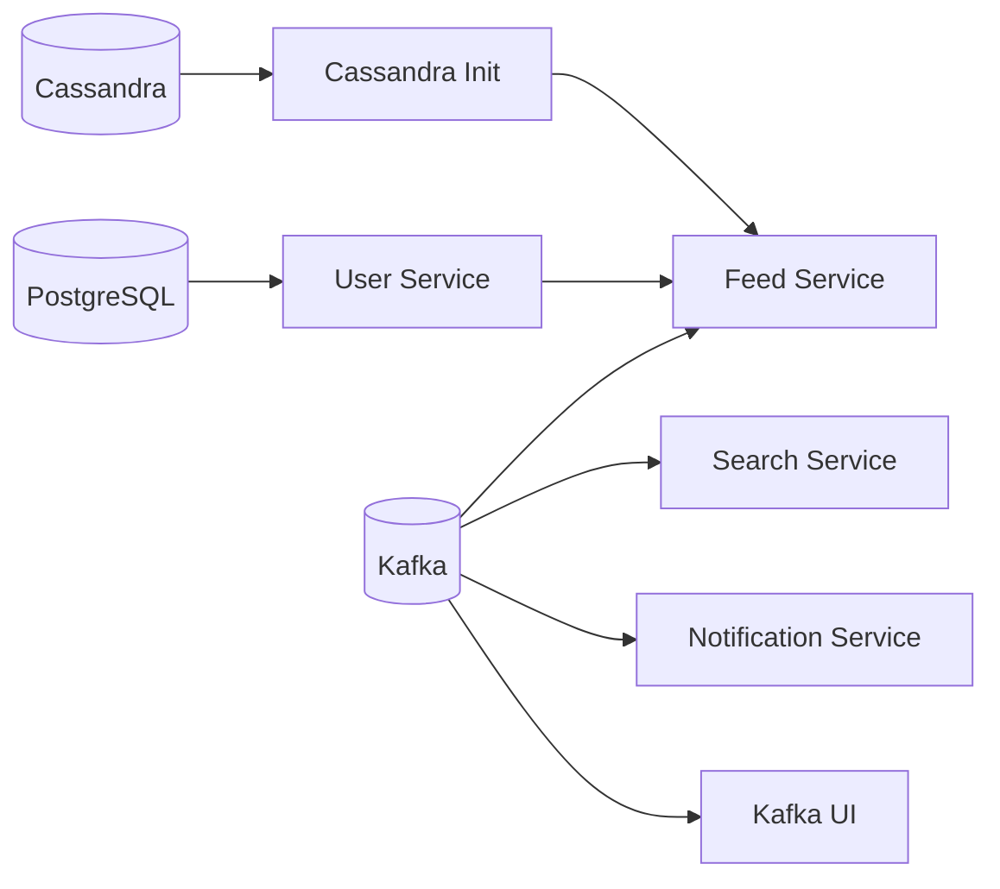

# Docker và Ubuntu/WSL

> Điều hướng: [Mục lục](README.md) · [Quick start](../README.md) · [Development](DEVELOPMENT.md) · [Database](DATABASE.md)

Tài liệu này mô tả cách build, chạy và xử lý lỗi toàn bộ DevConnect stack bằng Docker Compose.

## 1. Thành phần Compose

File [docker-compose.yml](../docker-compose.yml) khai báo 9 service:

| Service Compose | Container | Port host | Vai trò |
|---|---|---:|---|
| `postgres` | `devconnect-postgres` | 5432 | Database của User Service. |
| `cassandra` | `devconnect-cassandra` | 9042 | Database của Feed Service. |
| `cassandra-init` | `devconnect-cassandra-init` | Không expose | Tạo keyspace rồi thoát với code 0. |
| `kafka` | `devconnect-kafka` | 9092 | Event broker. |
| `kafka-ui` | `devconnect-kafka-ui` | 8085 | UI quan sát Kafka. |
| `user-service` | `devconnect-user-service` | 3000 | User API; container vẫn lắng nghe port 8081. |
| `feed-service` | `devconnect-feed-service` | 8082 | Feed API và Kafka producer. |
| `search-service` | `devconnect-search-service` | 8083 | Search API và Kafka consumer. |
| `notification-service` | `devconnect-notification-service` | 8084 | Notification API và Kafka consumer. |

Dependency startup:



Compose chờ healthcheck của PostgreSQL, Cassandra và Kafka; chờ `cassandra-init` hoàn tất; sau đó chờ User Service healthy trước khi khởi động Feed Service.

Trong Compose network, `feed-service` cấu hình `USER_SERVICE_BASE_URL=http://user-service:8081`. Spring Cloud OpenFeign dùng URL này cho named client `user-service`; đây là giao tiếp nội bộ trực tiếp, không đi qua API Gateway. Connect/read timeout hiện đều là 5 giây theo `feed-service/src/main/resources/application.yaml`.

## 2. Yêu cầu Ubuntu

- Docker Engine 20.10.4+.
- Docker Compose v2 (`docker compose`, không phải binary cũ `docker-compose`).
- Tối thiểu khoảng 4 GB RAM trống; Cassandra và bốn Maven build có thể cần nhiều hơn trong lần build đầu.
- Các port 3000, 5432, 8082–8085, 9042 và 9092 chưa bị process khác sử dụng.

Kiểm tra:

```bash
docker --version
docker compose version
docker info
```

Nếu mọi lệnh Docker đều cần `sudo`, có thể tiếp tục dùng `sudo docker compose ...`. Không trộn lệnh có và không có `sudo` cho cùng project vì dễ tạo file/cache khác owner.

## 3. Đảm bảo đang dùng source mới nhất

### Ubuntu/WSL dùng source trực tiếp trên ổ Windows

Nếu source nằm tại `D:\devconnect-microservice-demo`, đường dẫn WSL là:

```bash
cd /mnt/d/devconnect-microservice-demo
```

### Copy source vào Linux home

Không cần `sudo`:

```bash
cp -a /mnt/d/devconnect-microservice-demo "$HOME/"
cd "$HOME/devconnect-microservice-demo"
```

Nếu trước đó đã copy bằng `sudo`, sửa ownership:

```bash
sudo chown -R "$USER:$USER" "$HOME/devconnect-microservice-demo"
```

### Ubuntu dùng Git clone riêng

Source mới phải được commit/push từ máy phát triển trước, sau đó:

```bash
cd ~/devconnect-microservice-demo
git status
git pull --ff-only
```

Không dùng `git reset --hard` khi chưa kiểm tra thay đổi local.

### Xác nhận Compose đọc đúng file

```bash
pwd
echo "$COMPOSE_FILE"
docker compose -f ./docker-compose.yml config --services
```

Kết quả phải có đủ:

```text
postgres
cassandra
cassandra-init
kafka
kafka-ui
user-service
feed-service
search-service
notification-service
```

Nếu chỉ có 5 service, Ubuntu đang đọc source/Compose cũ. Nếu `COMPOSE_FILE` trỏ tới file khác, chạy `unset COMPOSE_FILE` hoặc luôn truyền `-f ./docker-compose.yml`.

## 4. Chạy toàn bộ hệ thống

Tại repository root:

```bash
docker compose -f ./docker-compose.yml up -d --build
```

Lần đầu Docker sẽ:

1. Pull PostgreSQL, Cassandra, Kafka, Kafka UI, Maven và JRE base image.
2. Build bốn application image.
3. Tạo network và named volume.
4. Khởi động infrastructure theo dependency.
5. Chạy Flyway khi User Service start.
6. Tạo Cassandra table khi Feed Service start.

Theo dõi:

```bash
docker compose -f ./docker-compose.yml ps -a
docker compose -f ./docker-compose.yml logs -f
```

Trạng thái mong đợi:

- PostgreSQL, Cassandra, Kafka và bốn application: `Up`/`healthy`.
- `cassandra-init`: `Exited (0)`; đây là thành công, không phải lỗi.
- Kafka UI: `Up`.

## 5. Dockerfile strategy

Mỗi application có Dockerfile riêng:

- `user-service/Dockerfile`
- `feed-service/Dockerfile`
- `search-service/Dockerfile`
- `notification-service/Dockerfile`

Mỗi Dockerfile dùng hai stage:

1. `maven:3.9.16-eclipse-temurin-21-noble`: resolve dependency và build executable JAR.
2. `eclipse-temurin:21-jre-noble`: chỉ chứa JRE và `app.jar`.

Runtime chạy bằng numeric user `10001`, không chạy root. `.dockerignore` loại Git metadata, IDE file, log và `target/` khỏi build context.

## 6. Workflow thường dùng

### Build lại toàn bộ

```bash
docker compose up -d --build --force-recreate --remove-orphans
```

### Build lại một service

```bash
docker compose up -d --build feed-service
```

### Bỏ toàn bộ Docker build cache

Chỉ dùng khi nghi cache giữ artifact cũ:

```bash
docker compose build --no-cache
docker compose up -d --force-recreate --remove-orphans
```

### Xem log

```bash
docker compose logs -f user-service
docker compose logs -f feed-service
docker compose logs -f search-service notification-service
docker compose logs -f postgres cassandra cassandra-init kafka
```

Giới hạn số dòng:

```bash
docker compose logs --tail=200 feed-service
```

### Restart

```bash
docker compose restart feed-service
```

`restart` không build lại source. Sau khi sửa Java code phải dùng `up -d --build SERVICE_NAME`.

### Chạy lệnh trong container

```bash
docker compose exec user-service java -version
docker compose exec postgres pg_isready -U devconnect -d devconnect_users
docker compose exec cassandra cqlsh -e "DESCRIBE KEYSPACE devconnect_feed"
```

## 7. Dừng và quản lý dữ liệu

Dừng/xóa container và network, giữ database volume:

```bash
docker compose down
```

Dừng tạm thời, giữ container:

```bash
docker compose stop
docker compose start
```

Xóa toàn bộ PostgreSQL/Cassandra data:

```bash
docker compose down -v
```

`down -v` là thao tác phá hủy dữ liệu local. Search/notification vốn ở memory nên mất khi container tương ứng restart dù không xóa volume.

## 8. Chạy application trên host để debug

Không chạy application container và application Maven trên cùng port. Chỉ dựng infrastructure:

```bash
docker compose up -d postgres cassandra cassandra-init kafka kafka-ui
```

Sau đó chạy bốn module bằng Maven theo [DEVELOPMENT.md](DEVELOPMENT.md#4-chạy-trực-tiếp-trên-host-tùy-chọn).

## 9. Troubleshooting

### Compose vẫn chỉ chạy 5 service

```bash
pwd
ls -l docker-compose.yml */Dockerfile
docker compose -f ./docker-compose.yml config --services
```

Nếu file không chứa bốn application service, copy/pull lại source. Nếu file đúng nhưng output sai, kiểm tra `COMPOSE_FILE`, `compose.yaml` hoặc `compose.yml` khác trong thư mục.

### Source đã đổi nhưng container vẫn chạy code cũ

```bash
SERVICE=feed-service
docker compose build --no-cache "$SERVICE"
docker compose up -d --force-recreate "$SERVICE"
```

Xác nhận đang build đúng directory bằng `pwd` và `docker compose config`.

### Container application unhealthy

```bash
SERVICE=feed-service
docker compose ps -a
docker compose logs --tail=300 "$SERVICE"
docker inspect --format '{{json .State.Health}}' "devconnect-${SERVICE}"
```

Healthcheck application chỉ kiểm tra TCP port. Log startup mới là nguồn thông tin chính để tìm lỗi database/configuration.

### Cassandra Init không exit 0

```bash
docker compose logs cassandra cassandra-init
docker compose up cassandra-init
```

### Port conflict

```bash
sudo ss -ltnp | grep -E ':(3000|5432|8082|8083|8084|8085|9042|9092)\b'
```

Dừng process/container xung đột hoặc đổi host port trong Compose.

### Docker hết RAM/disk

```bash
docker system df
free -h
df -h
```

Không chạy `docker system prune --volumes` nếu chưa hiểu dữ liệu nào sẽ bị xóa.
## Swagger UI aggregate

Compose có thêm service `swagger-ui` ở host port `8090`. Sau khi toàn bộ application healthy, mở:

```text
http://localhost:8090/
```

Service `swagger-spec` chạy trước `swagger-ui`, lấy bốn `/v3/api-docs` rồi gộp thành một file `/out/openapi.json`; vì vậy toàn bộ endpoint hiển thị trên cùng một trang Swagger.

Danh sách service phải bao gồm cả `notification-service` và `swagger-ui`:

```bash
docker compose config --services
docker compose ps -a
docker compose logs --tail=200 swagger-ui
```

Nếu dùng WSL, hãy chạy từ repository mới (`/mnt/d/devconnect-microservice-demo`) hoặc đồng bộ nội dung vào home bằng:

```bash
cp -r /mnt/d/devconnect-microservice-demo/. ~/devconnect-microservice-demo/
```

Compose dùng external network `devconnect-network`; tạo network một lần nếu chưa có:

```bash
docker network inspect devconnect-network >/dev/null 2>&1 || docker network create devconnect-network
```

Khi source hoặc Dockerfile vừa thay đổi, build lại không dùng cache:

```bash
docker compose down --remove-orphans
docker compose build --no-cache
docker compose up -d
```
