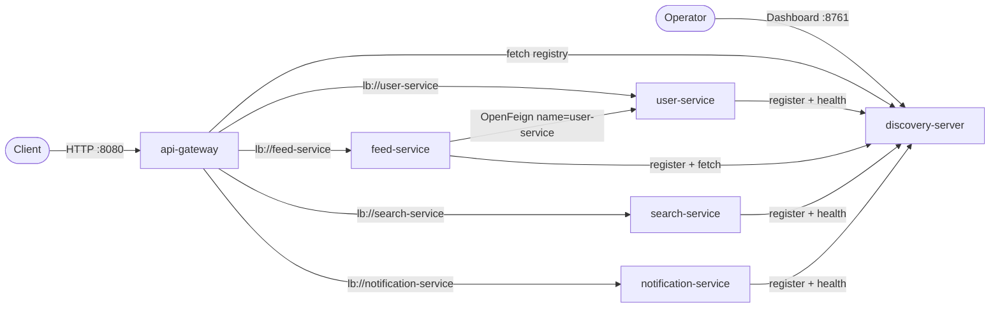
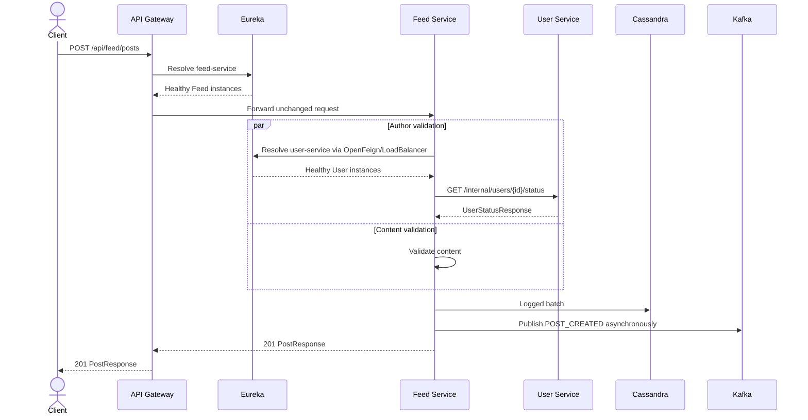

# DevConnect API Gateway and Eureka Design

## 1. Objective

Add a production-oriented service-discovery and edge-routing baseline to DevConnect without changing existing business API paths or Kafka behavior.

The implementation adds:

- a standalone `discovery-server` module using Netflix Eureka;
- an `api-gateway` module using Spring Cloud Gateway Server WebFlux;
- Eureka registration for all four business services;
- Eureka-backed Spring Cloud LoadBalancer routing at the Gateway;
- Eureka-backed OpenFeign resolution from Feed Service to User Service;
- health endpoints, bounded HTTP timeouts, Docker dependency wiring, tests, and synchronized documentation.

The local Compose deployment exposes only the Gateway as the public business API entry point. Direct business-service ports remain available inside the Compose network but are not published to the host.

## 2. Version and Dependency Baseline

The parent project keeps:

- Java `21`;
- Spring Boot `4.1.0`;
- Spring Cloud BOM `2025.1.2`.

This release train resolves Spring Cloud Gateway, Spring Cloud Netflix, OpenFeign, and Spring Cloud LoadBalancer `5.0.2` artifacts compatible with the current Boot generation.

New dependency roles:

| Module | Dependencies |
|---|---|
| `discovery-server` | `spring-cloud-starter-netflix-eureka-server`, `spring-boot-starter-actuator`, Boot test |
| `api-gateway` | `spring-cloud-starter-gateway-server-webflux`, `spring-cloud-starter-netflix-eureka-client`, `spring-cloud-starter-loadbalancer`, `spring-boot-starter-actuator`, WebFlux test |
| User/Feed/Search/Notification | `spring-cloud-starter-netflix-eureka-client` and `spring-boot-starter-actuator` |
| Feed only | Existing `spring-cloud-starter-openfeign` plus explicit `spring-cloud-starter-loadbalancer` |

The Gateway is a standalone WebFlux application. No MVC/data dependencies are added to it.

## 3. Topology



Infrastructure ownership remains unchanged:

- User Service → PostgreSQL;
- Feed Service → Cassandra and Kafka producer;
- Search/Notification → Kafka consumers and in-memory read models.

## 4. Discovery Server

### 4.1 Module

Create `discovery-server` as a normal Maven child module with:

- `DiscoveryServerApplication` annotated with `@SpringBootApplication` and `@EnableEurekaServer`;
- server port `${DISCOVERY_SERVER_PORT:8761}`;
- application name `discovery-server`;
- Actuator health/info exposure.

### 4.2 Standalone local mode

The local server is intentionally standalone:

```yaml
eureka:
  client:
    register-with-eureka: false
    fetch-registry: false
    service-url:
      defaultZone: http://${eureka.instance.hostname}:${server.port}/eureka/
```

`defaultZone` retains the exact camel-case spelling required by Eureka's map configuration.

This is appropriate for local/demo operation, not high availability. Production deployment guidance documents a three-peer Eureka cluster, TLS or protected network access, and authenticated dashboard/client traffic.

## 5. Eureka Clients

### 5.1 Shared behavior

Each business service adds Eureka Client and Actuator. Every service keeps its existing `spring.application.name`; that name is the Eureka service ID.

Runtime properties:

```yaml
eureka:
  client:
    service-url:
      defaultZone: ${EUREKA_SERVER_URL:http://localhost:8761/eureka/}
    healthcheck:
      enabled: true
    rest-template-timeout:
      connect-timeout: 5000
      connect-request-timeout: 5000
      socket-timeout: 10000
  instance:
    prefer-ip-address: ${EUREKA_PREFER_IP_ADDRESS:false}
    health-check-url-path: /actuator/health
    status-page-url-path: /actuator/info
```

Compose sets `EUREKA_SERVER_URL=http://discovery-server:8761/eureka/` and `EUREKA_PREFER_IP_ADDRESS=true`. Host-run defaults point to localhost.

Actuator exposes only `health` and `info`; health details are not publicly disclosed.

### 5.2 Register/fetch responsibilities

| Component | Register | Fetch registry | Reason |
|---|---:|---:|---|
| User Service | Yes | No | Receives traffic; does not call another discovered service. |
| Feed Service | Yes | Yes | Receives traffic and discovers User Service for OpenFeign. |
| Search Service | Yes | No | Receives traffic; Kafka is configured separately. |
| Notification Service | Yes | No | Receives traffic; Kafka is configured separately. |
| API Gateway | No | Yes | Uses the registry for routing; is the external edge itself. |
| Discovery Server | No | No | Standalone registry in local Compose. |

Tests disable discovery with `eureka.client.enabled=false` or `spring.cloud.discovery.enabled=false`, so unit/context tests do not require a running registry.

## 6. API Gateway

### 6.1 Module

Create `api-gateway` with:

- `ApiGatewayApplication` using plain `@SpringBootApplication`;
- WebFlux Gateway Server starter;
- Eureka Client and LoadBalancer;
- Actuator;
- port `${API_GATEWAY_PORT:8080}`.

### 6.2 Explicit allowlist routes

Discovery Locator remains disabled. Routes are explicitly declared under the Spring Cloud Gateway 5 namespace:

```yaml
spring:
  cloud:
    gateway:
      server:
        webflux:
          routes:
            - id: user-service
              uri: lb://user-service
              predicates:
                - Path=/api/users/**
            - id: feed-service
              uri: lb://feed-service
              predicates:
                - Path=/api/feed/**
            - id: search-service
              uri: lb://search-service
              predicates:
                - Path=/api/search/**
            - id: notification-service
              uri: lb://notification-service
              predicates:
                - Path=/api/notifications/**
```

No path rewrite is required because downstream services already own these paths.

The Gateway does not route:

- `/internal/**`;
- Eureka dashboard/API paths;
- downstream `/actuator/**` endpoints;
- unknown services discovered at runtime.

This prevents accidental exposure when a new service registers with Eureka.

### 6.3 Gateway HTTP policy

Global downstream HTTP settings:

```yaml
spring:
  cloud:
    gateway:
      server:
        webflux:
          httpclient:
            connect-timeout: ${GATEWAY_CONNECT_TIMEOUT_MS:5000}
            response-timeout: ${GATEWAY_RESPONSE_TIMEOUT:10s}
```

The Gateway preserves downstream paths, status codes, response bodies, and content types. It adds standard forwarded headers through Gateway's built-in behavior; downstream services use the framework forwarded-header strategy.

When no healthy instance exists, the load-balanced route returns a service-unavailable response. Connect/response timeout failures are edge errors and do not mutate downstream state.

Authentication, authorization, TLS termination, rate limiting, distributed tracing, and circuit breakers are documented production follow-ups rather than invented without an identity/platform model.

## 7. Feed-to-User OpenFeign Discovery

`UserServiceClient` stays declarative:

```java
@FeignClient(name = "user-service")
```

Remove `spring.cloud.openfeign.client.config.user-service.url` and `USER_SERVICE_BASE_URL`. Keep the named-client connect/read timeouts:

```yaml
spring:
  cloud:
    openfeign:
      client:
        config:
          user-service:
            connectTimeout: 5000
            readTimeout: 5000
```

With no explicit URL, OpenFeign uses `user-service` as the service ID. Spring Cloud LoadBalancer obtains healthy instances through Eureka and selects an instance for the blocking request.

`UserServiceAdapter` remains the exception boundary:

- User 404/invalid response → `BusinessException("Author not found")`;
- discovery, connection, timeout, decoding, or other Feign failure → `DownstreamServiceException("Failed to call User Service")`.

The API Gateway is not involved in this internal call.

## 8. Docker Compose and Images

### 8.1 Compose services

Compose grows from 9 to 11 services by adding:

- `discovery-server`, published as `8761:8761`;
- `api-gateway`, published as `8080:8080`.

Business services change from host-published ports to internal-only exposure:

| Service | Container port | Host publication |
|---|---:|---|
| User | 8081 | None |
| Feed | 8082 | None |
| Search | 8083 | None |
| Notification | 8084 | None |

Infrastructure ports remain published for local development. Eureka Dashboard remains available at `http://localhost:8761`; all public business API calls use `http://localhost:8080`.

### 8.2 Startup dependencies

```text
databases/Kafka ----> business services
discovery-server ---> business services
discovery-server ---> api-gateway
business services --register asynchronously--> discovery-server
```

Gateway startup does not require every business service to be available. A route can return 503 until the target registers and its registry entry becomes visible.

### 8.3 Dockerfiles

Add non-root multi-stage Dockerfiles for the two new modules, matching existing application images. Because the root POM lists all modules, every application Dockerfile must copy all six module POMs before Maven dependency resolution.

Container healthchecks remain bounded and inspect the local application port. Compose uses health conditions for Eureka/infrastructure startup ordering but does not treat service registration propagation as a transactional startup step.

## 9. HTTP Flows

### 9.1 External create-post flow



### 9.2 Read flow

Client calls the same existing path through port 8080. Gateway resolves the relevant service ID from Eureka and forwards the request without rewriting the path or response.

### 9.3 Registration flow

On startup, each business service registers its application name, address, port, and health metadata with Eureka. It sends heartbeats and propagates Actuator health. Gateway and Feed fetch registry data and use Spring Cloud LoadBalancer for instance selection.

## 10. Error and Availability Semantics

| Failure | Observable result |
|---|---|
| Unknown Gateway path | Gateway 404; no downstream call. |
| Internal path requested through Gateway | Gateway 404; endpoint is not routed. |
| No registered/healthy destination instance | Gateway 503. |
| Gateway downstream connect/response timeout | Gateway edge error (503/504 depending failure stage). |
| Eureka temporarily unavailable after clients cached registry | Cached instances may remain usable until cache/lease behavior expires. |
| Eureka unavailable during fresh startup | Services retry registration/fetch; Gateway routes have no instance until discovery recovers. |
| Feed cannot discover/call User | Existing Feed error contract returns 503 `Failed to call User Service`. |

No automatic retry is added to write routes. Retrying POST without an idempotency key could create duplicate effects.

## 11. Test Strategy

### Discovery Server

- Context test verifies Eureka Server starts with client behavior disabled.

### API Gateway

- Context test verifies Eureka/Discovery can be disabled for isolated tests.
- Route-definition test verifies exactly four allowlisted `lb://` routes.
- WebFlux test verifies unknown/internal paths are not routed.

### Business Services

- Existing tests keep running with discovery disabled.
- Feed context verifies the Feign proxy and LoadBalancer dependencies coexist.
- Adapter/service/controller behavior remains unchanged.

### Repository and Compose

- `mvn clean test` runs all six modules.
- Dependency-tree checks verify Gateway/Eureka/LoadBalancer starters.
- `docker compose config` validates the 11-service graph.
- Docker build and local smoke tests verify registration, Gateway routing, hidden direct host ports, create-post, search, notification, and failure behavior when a service is unavailable.

## 12. Documentation Scope

Update all current documentation:

- root `README.md`;
- `docs/README.md`;
- `docs/ARCHITECTURE.md`;
- `docs/API.md`;
- `docs/DEVELOPMENT.md`;
- `docs/DOCKER.md`;
- `docs/DATABASE.md` where service access boundaries are described;
- `ASYNC-JAVA.md` for the additional Gateway/discovery hops;
- add `docs/GATEWAY-DISCOVERY.md` as the focused setup, configuration, operations, troubleshooting, and production-hardening guide.

Historical specs/plans remain historical and are not rewritten.

## 13. Production Boundary

This change creates a production-oriented baseline, not a claim of production readiness.

Included:

- single public application entry point;
- explicit API allowlist;
- internal endpoint isolation at the Gateway;
- service discovery and client-side load balancing;
- health propagation and bounded HTTP timeouts;
- environment-driven configuration;
- non-root containers and deterministic tests.

Still required for a real production deployment:

- multiple Eureka peers across failure domains;
- TLS/mTLS and protected Eureka access;
- authentication/authorization at Gateway and service layers;
- rate limiting, circuit breaker policy, metrics, tracing, centralized logs, and alerting;
- external load balancer/DNS in front of multiple Gateway instances;
- secrets management and deployment-orchestrator readiness probes;
- idempotency strategy before retrying write requests.

## 14. Authoritative References

- Spring Cloud Gateway 5.0.2: <https://docs.spring.io/spring-cloud-gateway/reference/>
- Gateway DiscoveryClient routes: <https://docs.spring.io/spring-cloud-gateway/reference/spring-cloud-gateway-server-webflux/the-discoveryclient-route-definition-locator.html>
- Spring Cloud Netflix Eureka: <https://docs.spring.io/spring-cloud-netflix/docs/current/reference/html/>
- Spring Cloud OpenFeign URL resolution: <https://docs.spring.io/spring-cloud-openfeign/reference/spring-cloud-openfeign.html>
- Spring Cloud LoadBalancer: <https://docs.spring.io/spring-cloud-commons/reference/spring-cloud-commons/loadbalancer.html>
